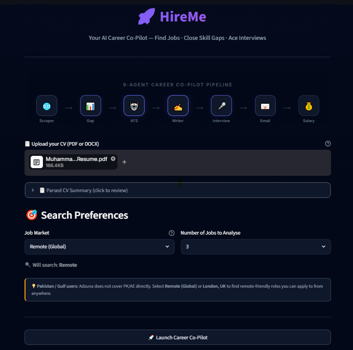
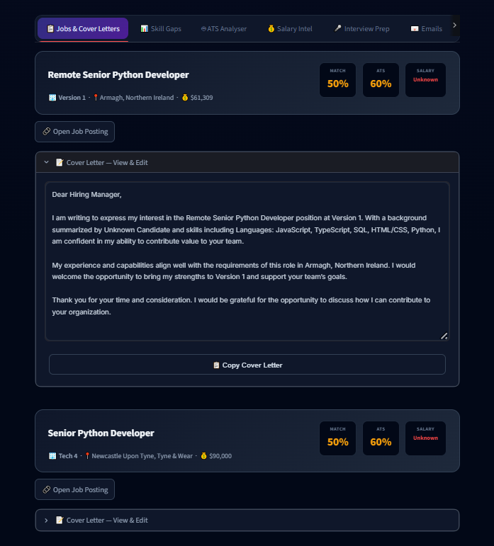
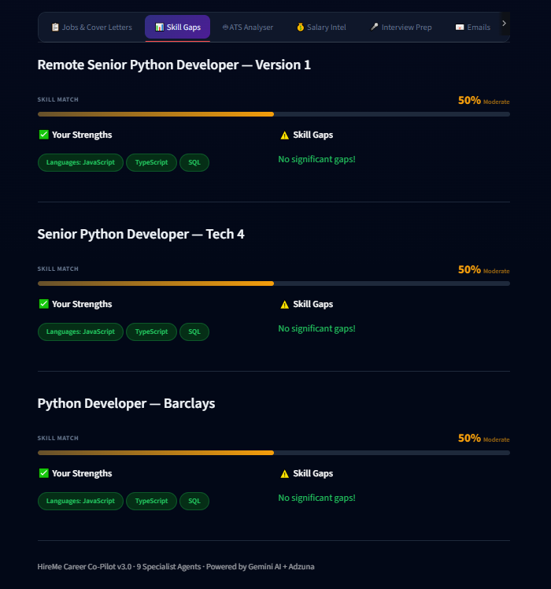
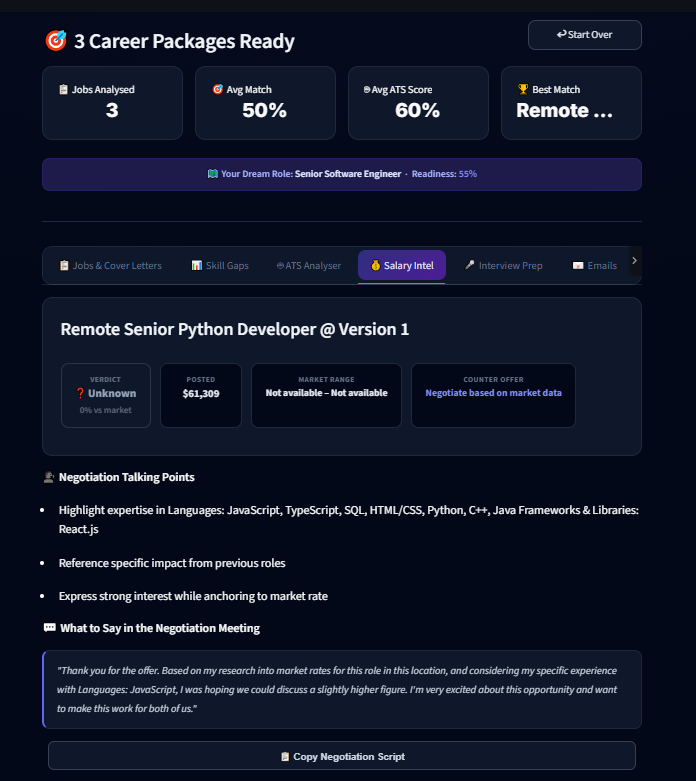
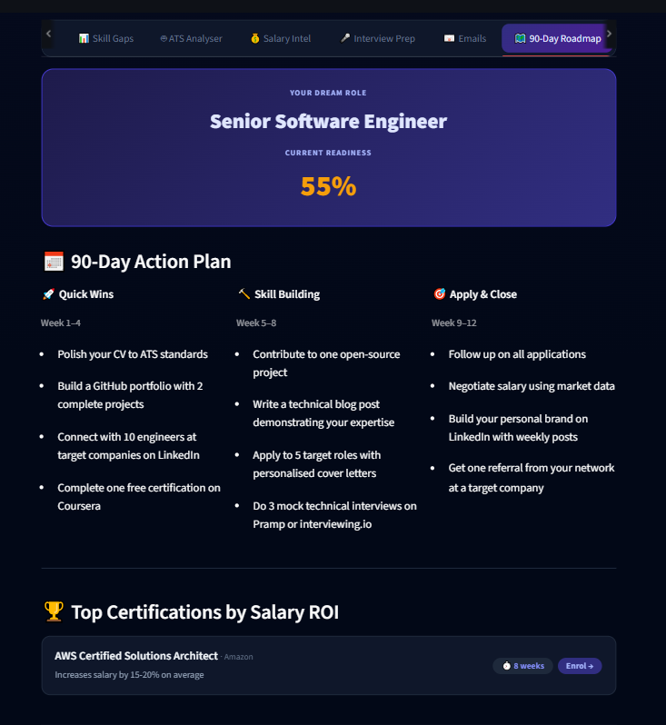

# HireMe Agent: AI Career Co-Pilot

HireMe is an AI-powered multi-agent application designed to automate career assistance, resume analysis, and job matching. The system parses uploaded resumes, searches for matching opportunities using the Adzuna API, identifies skill gaps, analyzes ATS keyword matching, drafts cover letters and recruiter emails, performs salary benchmarks, and generates a 90-day action plan.

## 📸 Interface Preview

### 🏠 Home & Resume Upload


### 📋 Jobs & Cover Letters


---

## Directory Structure

```text
.
├── docs/                     # Project documentation, slides, and sample resumes
├── hireme_agent/             # Core application directory
│   ├── src/                  # Main application source code
│   │   ├── agents/           # Core agent implementations (ATS, Gap Analyst, Roadmap, etc.)
│   │   ├── config/           # Application configuration and settings loaders
│   │   ├── memory/           # In-memory state and data stores
│   │   ├── parsers/          # Resume file parsers (PDF, DOCX)
│   │   ├── tools/            # External APIs and scraping tools
│   │   └── ui/               # Streamlit interface views and layout pages
│   ├── app.py                # Streamlit application entry point
│   ├── debug_pipeline.py     # Command-line diagnostic script for APIs and parsers
│   └── requirements.txt      # Python dependencies manifest
├── .gitignore                # Git exclusion list (excludes virtual environments and secret files)
├── README.md                 # Primary project documentation
└── run.ps1                   # Local Windows bootstrapper script
```

---

## Key Features

- **CV Text Extraction**: Parses text from PDF and DOCX formats.
- **Smart Job Search**: Leverages the Adzuna API with auto-detected country settings to find relevant job openings.
- **Skill Gap & ATS Analysis**: Evaluates resume suitability against job posts, scores match alignment, identifies missing skills, and checks keyword density.
- **Automated Copywriting**: Generates personalized cover letters, cold pitch emails, and follow-up templates matching candidates' backgrounds to specific roles.
- **Interview Preparation**: Generates role-tailored interview questions with model answers.
- **Salary Intelligence**: Analyzes job compensation against market benchmarks and provides negotiation talking points.
- **Strategic Roadmap**: Generates a structured 90-day readiness roadmap including suggested certifications and portfolio projects.

## 📊 Core Analysis Previews

### 📊 Skill Gaps Analysis


### 💰 Salary Intelligence & Benchmarks


### 🗺️ 90-Day Career Roadmap


---

## Architecture

The system utilizes an orchestrator-agent architecture containing 9 specialized agent tasks:

1. **Search Agent**: Formulates queries and retrieves job listings.
2. **Scraper Agent**: Extracts and processes job description details.
3. **Gap Analyst**: Performs resume-to-job matching and skill assessments.
4. **ATS Analyser**: Audits keyword coverage and optimizes CV copy.
5. **Writer Agent**: Generates cover letters.
6. **Interview Agent**: Prepares tailored interview Q&As.
7. **Email Drafter**: Creates outreach email templates.
8. **Salary Intelligence**: Conducts market compensation checks.
9. **Career Roadmap Agent**: Structures the 90-day development plan.

## Setup & Installation

### 1. Environment Setup

Clone the repository and set up a virtual environment:

```bash
git clone https://github.com/mtayyab-10/automated-job-search-agent.git
cd automated-job-search-agent
python -m venv .venv
```

Activate the virtual environment:

- **Windows (PowerShell)**:
  ```powershell
  .\.venv\Scripts\Activate.ps1
  ```
- **macOS/Linux**:
  ```bash
  source .venv/bin/activate
  ```

### 2. Install Dependencies

Install the required packages:

```bash
pip install -r hireme_agent/requirements.txt
```

### 3. Configuration

Create a `.env` file inside the `hireme_agent/` directory with the following keys:

```ini
GEMINI_API_KEY=your_gemini_api_key
ADZUNA_APP_ID=your_adzuna_app_id
ADZUNA_APP_KEY=your_adzuna_app_key
ADZUNA_COUNTRY=us
```

## Running the Application

To run the Streamlit web interface:

```bash
streamlit run hireme_agent/app.py
```

On Windows, the application can also be started using the included helper script:

```powershell
./run.ps1
```

To run diagnostic tests on the API and parser pipeline:

```bash
python hireme_agent/debug_pipeline.py
```

## 👨‍💻 Author

**Muhammad Tayyab**  
*Computer Scientist & AI Developer*  
- **Specialization**: Intelligent Multi-Agent Systems & Software Engineering

## 🤝 Contributing

Contributions to improve the agentic capabilities, parse logic, or UI styling are welcome. To contribute:
1. Fork the repository.
2. Create a feature branch (`git checkout -b feature/amazing-feature`).
3. Commit changes with clear, descriptive commit messages.
4. Push to the branch (`git push origin feature/amazing-feature`).
5. Open a Pull Request for review.

## 📄 License

This project is licensed under the MIT License. See the `LICENSE` file for details.
